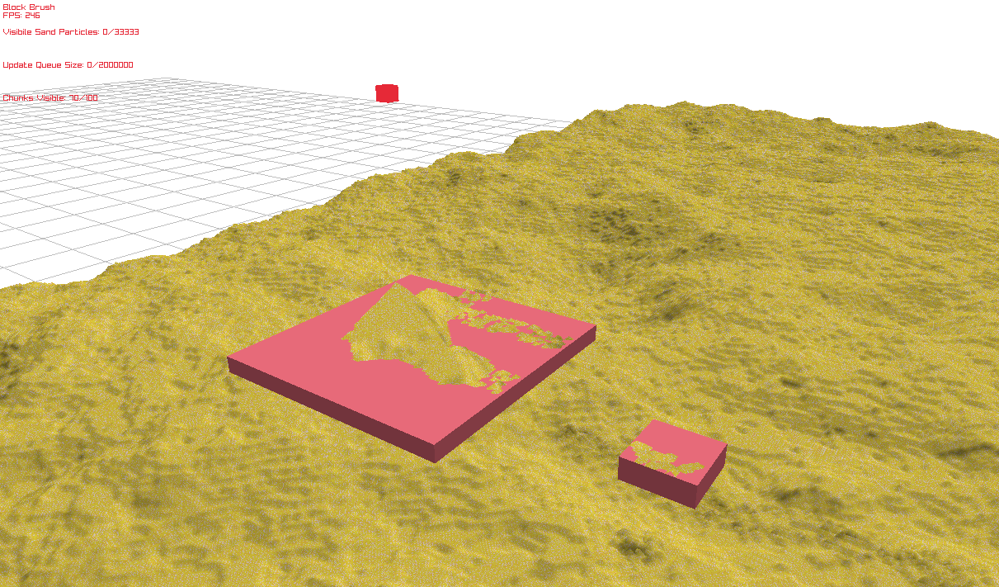

# Sand Simulation
## By mwl-6

Created using C and Raylib

How to Use:
- Arrows Keys to Move Camera
- Mouse to Rotate Camera
- Scroll to Zoom In/Out

Sand Dropper (red box):
- IJKL to Move
- SPACE to Drop Sand
